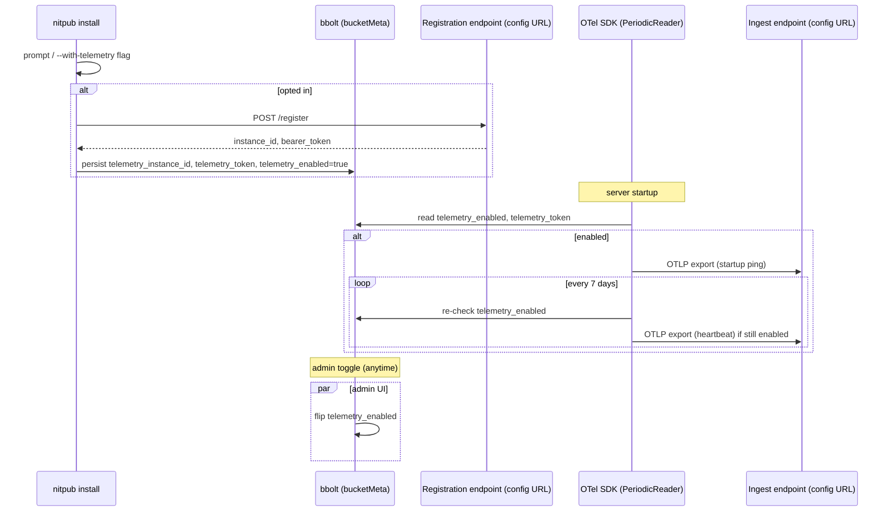

# Version Telemetry - Plan

## Goal Capsule

**Objective:** Give Jon (solo maintainer) visibility into which nitpub versions are actually installed/running across opt-in self-hosted instances, shipped via OTel to a self-hosted Grafana instance he operates privately. (Private infra details — hostnames, org names, endpoint URLs — are deliberately never recorded in this public repo; the receiving endpoint is a configuration value.)

**Product authority:** STRATEGY.md already names this as a metric source — "30/90-day active-instance retention" and "Opt-in install count" both assume opt-in telemetry exists.

**Product Contract preservation:** Product Contract unchanged from the requirements-only version; this enrichment adds the Planning Contract, Implementation Units, and Verification Contract below.

**Target repo:** nitpub (this repo). The receiving infra — gatekeeper proxy, OTel Collector, Grafana — is a separate, private lab-stack deployment and is **out of scope for this plan and this repo**; nitpub only needs the registration and ingest URLs as configuration values.

---

## Problem Frame

No mechanism exists today to see which versions of nitpub are deployed in the field. The only related code is `internal/updatecheck` + `AdminCheckVersion` (`internal/api/admin_version.go:22`) — the opposite direction: a single instance pulls the latest GitHub release to check itself, admin-only, nothing leaves the instance.

---

## Requirements

**R1.** An opted-in instance sends a startup ping and a weekly heartbeat carrying: instance UUID, `version.Version`, OS/arch, and enabled feature flags (federation on/off, moderation mode). No PII.

**R2.** Opt-in is prompted once at first-run/install, and independently toggleable anytime after via an admin UI setting. Default off — no data leaves an instance until explicit opt-in.

**R3.** Before any telemetry is accepted, the instance registers itself against the receiving endpoint and receives a bearer credential; all pings after that point carry it.

**R4.** The receiving endpoint URL(s) are runtime configuration, never hardcoded or committed to source.

**R5.** Telemetry shipping uses the OpenTelemetry Go SDK (OTLP/HTTP metrics exporter), not a hand-rolled JSON client.

---

## Scope Boundaries

**In scope (this repo):**
- Config fields for telemetry enablement + endpoint URLs
- Local instance-identity generation and persistence (UUID + registration token)
- Registration HTTP call against the (externally supplied) registration endpoint
- OTel SDK wiring: startup ping + weekly heartbeat via `PeriodicReader`
- Install-wizard prompt (`nitpub install`)
- Admin API + UI toggle
- Unit tests for all of the above

**Out of scope / deferred to follow-up work:**
- The gatekeeper proxy, OTel Collector, and Grafana deployment (separate, private lab-stack repo — not built here)
- Posting-cadence telemetry (median posts/week) — a later, separate signal per STRATEGY.md
- RSS/resource-footprint reporting — measured directly by the maintainer, not instance-reported
- Retention/deletion policy for stored registrations and telemetry data on the receiver side (receiver-side concern, not this repo)

---

## Key Technical Decisions

**KTD1 — Registration + heartbeat, not a bare anonymous ping.** (session-settled: user-directed — chosen over an unauthenticated open endpoint: reduces false/spoofed signal inflating install counts.) A `POST /register` call at opt-in mints a bearer token tied to the instance UUID; every later OTLP export carries it. This repo only needs to *call* registration and store what it returns — the server-side "known device" store lives in the (private, out-of-scope) receiver.

**KTD2 — OTel Go SDK metrics, OTLP/HTTP exporter.** Package `go.opentelemetry.io/otel/exporters/otlp/otlpmetric/otlpmetrichttp` + `go.opentelemetry.io/otel/sdk/metric`'s `PeriodicReader`, per the upstream docs (default endpoint shape `<base>/v1/metrics`, protobuf over HTTP). The bearer token attaches via the exporter's per-request header option — matches R3/R5. New dependency: `go.opentelemetry.io/otel` + the two named exporter/SDK submodules.

**KTD3 — Identity storage: bbolt `bucketMeta`, not a new bucket or file.** (Reuse over invention: `internal/store/store.go:28` already has a singleton key-value bucket (`bucketMeta`) with exactly this shape — see its use in `internal/store/store_test.go:46`.) Store `telemetry_instance_id` and `telemetry_token` as keys there. No new bucket, no new file on disk.

**KTD4 — Token generation reuses the existing rand+hex pattern.** `internal/auth/session.go:23` already does `rand.Read` + `hex.EncodeToString` for session tokens; the same shape produces the instance UUID (or a random 128-bit ID — an instance UUID does not need RFC 4122 structure here, just uniqueness).

**KTD5 — Config shape follows the Analytics precedent, with one deliberate divergence.** `internal/config/config.go:35` (`AnalyticsEnabled` et al.) is deploy-time-only, read once at startup, no runtime toggle — comment there cites `docs/plans/2026-08-23-001-feat-goatcounter-analytics-plan.md` as the reasoning. Telemetry diverges: R2 requires a runtime-toggleable admin setting, not just a deploy-time flag. So: `TelemetryEndpointURL` (and any receiver-supplied ingest URL) stay deploy-time config fields (`config.Config`, TOML), matching Analytics — but `TelemetryEnabled` is instead a **runtime** value stored in `bucketMeta` (own key, read at request time by the admin handler and by the heartbeat scheduler's tick), not a config field. This lets the admin toggle flip it without a restart, while the receiving-endpoint shape stays static like Analytics' `AnalyticsBaseURL`.

**KTD6 — Heartbeat scheduling reuses the existing ticker pattern.** `internal/federation/keyfetch.go:20` already runs a `time.NewTicker`-driven background goroutine started from server setup. The weekly-heartbeat goroutine follows the same shape: started once in `internal/server/server.go` (near `New`, `internal/server/server.go:43`), ticks weekly, checks the runtime `TelemetryEnabled` flag each tick (so toggling off stops future sends without a restart), sends nothing if disabled.

**KTD7 — CLI opt-in prompt reuses the `install_cmd.go` tribool flag pattern.** `cmd/nitpub/install_cmd.go:77` (`--with-analytics`/`--no-analytics` → `gateChoice` → `tribool`) is the existing shape for "ask interactively unless a flag settles it." Add `--with-telemetry`/`--no-telemetry` the same way; on yes, run registration during install and persist the resulting identity via KTD3 before the wizard finishes.

---

## High-Level Technical Design



Registration is a plain HTTP call (not OTel) since it's a one-shot credential exchange before any OTLP traffic starts; OTLP itself only carries the metrics payload plus the bearer header, per KTD2.

---

## Implementation Units

### U1. Config fields for telemetry endpoints

**Goal:** Add deploy-time config for where registration/ingest requests go, following the Analytics field pattern.

**Requirements:** R4, KTD5

**Dependencies:** none

**Files:**
- `internal/config/config.go` — add `TelemetryRegisterURL`, `TelemetryIngestURL` (mirroring `AnalyticsBaseURL` at `internal/config/config.go:35`); TOML keys in the `fileConfig` struct
- `internal/config/config_test.go` — parse test for the new keys

**Approach:**
1. Both fields optional/empty by default — telemetry cannot function without them regardless of the opt-in flag, so treat empty as "opt-in unavailable" downstream (U4, U5 read this).
2. No default value pointing at any real host — never hardcode a URL (R4).

**Patterns to follow:** `AnalyticsBaseURL` field + comment block at `internal/config/config.go:35`.

**Test scenarios:**
- Config with both URLs set parses correctly.
- Config with URLs omitted parses to empty strings, no error.
- Existing config files without these keys still load (backward compatible).

**Verification:** `go test ./internal/config/...` passes; existing config fixtures still load unchanged.

---

### U2. Instance identity storage in bbolt

**Goal:** Persist instance UUID, registration token, and the runtime enabled flag in `bucketMeta`.

**Requirements:** R1, R3, KTD3, KTD4, KTD5

**Dependencies:** none

**Files:**
- `internal/store/telemetry.go` (new) — `GetTelemetryIdentity`, `SetTelemetryIdentity(id, token string)`, `TelemetryEnabled() bool`, `SetTelemetryEnabled(bool) error`, all against `bucketMeta`
- `internal/store/telemetry_test.go` (new)

**Approach:**
1. Keys: `telemetry_instance_id`, `telemetry_token`, `telemetry_enabled` (stored as `"1"`/`""` or absent, matching the existing meta bucket's byte-value convention — see `internal/store/store_test.go:46`).
2. `TelemetryEnabled()` treats "key absent" as `false` (off by default, per R2).
3. ID/token generation itself lives in the caller (U3), not here — this unit is pure storage.

**Patterns to follow:** `bucketMeta` read/write shape in `internal/store/store_test.go:46-61`.

**Test scenarios:**
- Set then get identity round-trips correctly.
- `TelemetryEnabled()` returns `false` when never set.
- `SetTelemetryEnabled(true)` then `(false)` toggles correctly and persists across a store reopen (`Open`/close/`Open` cycle, matching `internal/store/store_test.go:41-61`).

**Verification:** `go test ./internal/store/...` passes.

---

### U3. Registration client

**Goal:** Call the configured registration endpoint at opt-in time and obtain a bearer token.

**Requirements:** R3, KTD1, KTD4

**Dependencies:** U1, U2

**Files:**
- `internal/telemetry/register.go` (new package) — `Register(ctx, registerURL string) (instanceID, token string, err error)`
- `internal/telemetry/register_test.go` (new)

**Approach:**
1. Generate a random local instance ID with the `rand.Read`+`hex.EncodeToString` shape from `internal/auth/session.go:23` before calling — send it in the registration request body so the receiver can tie its issued token to this ID (exact request/response JSON shape is a receiver-side contract; treat it as `{"instance_id": "..."} -> {"token": "..."}` and adjust to match the deployed receiver once built).
2. `http.Client` with a bounded timeout (mirror `updatecheck.client`'s `60 * time.Second` at `internal/updatecheck/updatecheck.go:19`).
3. On any failure (network, non-2xx), return an error — caller decides whether to abort opt-in or retry; do not silently mark telemetry enabled without a token.

**Execution note:** Registration's exact wire contract depends on the not-yet-built private receiver — write this against the placeholder shape above, and treat the receiver's actual response format as an execution-time detail to confirm once that side exists.

**Test scenarios:**
- Successful registration (mock HTTP server) returns instance ID + token.
- Non-2xx response returns an error, no partial state persisted by the caller.
- Network timeout returns an error within the bounded timeout.

**Verification:** `go test ./internal/telemetry/...` passes against a local `httptest.Server`.

---

### U4. OTel SDK wiring: startup ping + weekly heartbeat

**Goal:** Ship the opted-in fields (R1) via OTLP on startup and every 7 days, following the existing ticker-goroutine pattern.

**Requirements:** R1, R5, KTD2, KTD6

**Dependencies:** U1, U2

**Files:**
- `internal/telemetry/ship.go` (new) — builds the OTel meter provider (`otlpmetrichttp` exporter + `metric.PeriodicReader`), records the gauge/counter fields, exposes `Start(ctx, cfg, store) (stop func())`
- `internal/telemetry/ship_test.go` (new)
- `internal/server/server.go` — call `telemetry.Start` near existing setup (`internal/server/server.go:43`), same call site tier as the `keyfetch` ticker start in `internal/federation/keyfetch.go:20`
- `go.mod` / `go.sum` — add `go.opentelemetry.io/otel`, `go.opentelemetry.io/otel/sdk/metric`, `go.opentelemetry.io/otel/exporters/otlp/otlpmetric/otlpmetrichttp`

**Approach:**
1. On `Start`: if `store.TelemetryEnabled()` is false or `cfg.TelemetryIngestURL` is empty, no-op (return a no-op stop func) — telemetry must default to fully inert (R2).
2. Otherwise: construct the OTLP/HTTP exporter with `WithEndpointURL(cfg.TelemetryIngestURL)` and a per-request `Authorization: Bearer <token>` header (from `store.GetTelemetryIdentity`), wrap in a `PeriodicReader` at a 7-day export interval, and additionally force one immediate export right after startup (PeriodicReader's interval alone would delay the first ping by a full period — trigger an explicit first `Collect`/export call, or set a short initial interval then reconfigure, whichever the SDK version's API makes cleaner at implementation time).
3. Recorded attributes/values: `version.Version` (`internal/version/version.go:6`), `updatecheck.ArchSuffix()` (`internal/updatecheck/updatecheck.go:105`), federation-enabled flag, moderation-mode value — as OTel resource attributes or metric attributes (implementer's call on OTel semantic fit; either satisfies R1).
4. Each tick re-reads `store.TelemetryEnabled()` before exporting — an admin toggling off between heartbeats stops future sends without a restart (KTD5/KTD6).
5. `stop func()` shuts the reader down cleanly for graceful server shutdown.

**Technical design:**
```
Start(ctx, cfg, store):
  if !store.TelemetryEnabled() or cfg.TelemetryIngestURL == "": return noop
  exporter := otlpmetrichttp.New(WithEndpointURL(ingestURL), WithHeaders({Authorization: bearer}))
  reader := metric.NewPeriodicReader(exporter, WithInterval(7 * 24h))
  provider := metric.NewMeterProvider(WithReader(reader), WithResource(instanceAttrs))
  recordGaugesOnce(provider)   // startup ping
  return provider.Shutdown
```

**Patterns to follow:** ticker-goroutine lifecycle in `internal/federation/keyfetch.go:20`; timeout/client conventions in `internal/updatecheck/updatecheck.go:19`.

**Test scenarios:**
- `TelemetryEnabled() == false` → `Start` returns a working no-op stop, no HTTP call made (assert via a test double exporter or a `httptest.Server` that fails the test if hit).
- Enabled + valid config → one export observed shortly after `Start` (startup ping), request carries the `Authorization` bearer header, correct version/arch fields present.
- Toggling `TelemetryEnabled` to `false` between ticks suppresses the next scheduled export (test with a short interval override for speed, not the real 7-day value).
- `stop()` shuts down without hanging or panicking.

**Verification:** `go test ./internal/telemetry/... ./internal/server/...` passes; manual smoke: run with a local `httptest.Server` standing in for the ingest endpoint, opt in via CLI, confirm one POST arrives.

---

### U5. Install-wizard opt-in prompt

**Goal:** Let `nitpub install` ask for telemetry opt-in (or accept `--with-telemetry`/`--no-telemetry`), and run registration on yes.

**Requirements:** R2, R3, KTD7

**Dependencies:** U1, U2, U3

**Files:**
- `cmd/nitpub/install_cmd.go` — new `withTelemetry, noTelemetry` flags + `WithTelemetry tribool` field, following `withAnalytics`/`noAnalytics` at `cmd/nitpub/install_cmd.go:26,77,106`
- `internal/install/*.go` — wire the prompt into the interactive flow (mirror wherever `WithAnalytics` triggers its prompt, per `cmd/nitpub/install_cmd.go:176,241,281`) and call `telemetry.Register` + `store.SetTelemetryIdentity`/`SetTelemetryEnabled` on yes

**Approach:**
1. If `cfg.TelemetryRegisterURL` is empty (U1), skip the prompt entirely — nothing to opt into (matches U4's inert-by-default rule).
2. On yes: call `telemetry.Register` (U3); on success, persist via `store` (U2) and enable; on failure, warn and leave telemetry disabled rather than failing the whole install.
3. Re-runs: if identity already persisted, skip re-registration (matches the "re-runs are lossless" convention noted in `install_cmd.go`'s doc comment).

**Patterns to follow:** `WithAnalytics` tribool flow end-to-end in `cmd/nitpub/install_cmd.go`.

**Test scenarios:**
- `--with-telemetry` non-interactive: registration called, identity persisted, enabled=true.
- `--no-telemetry`: no registration call, enabled stays false.
- Registration failure during install: install still completes, telemetry left disabled, warning surfaced.
- Re-run with identity already present: registration not called again.
- `TelemetryRegisterURL` unset: prompt/flags skipped entirely, no-op.

**Verification:** `go test ./cmd/nitpub/... ./internal/install/...` passes.

---

### U6. Admin API + UI toggle

**Goal:** Let the admin enable/disable telemetry anytime after install, alongside the existing version-check UI.

**Requirements:** R2

**Dependencies:** U2

**Files:**
- `internal/api/admin_telemetry.go` (new) — `AdminGetTelemetryStatus`, `AdminSetTelemetryEnabled`, following `internal/api/admin_analytics.go`'s auth/method-check shape and `internal/api/admin_version.go`'s response-struct shape
- `internal/api/admin_telemetry_test.go` (new)
- `internal/api/handlers.go` — route registration, mirroring existing admin routes
- Admin frontend (`web/` or wherever the existing version-check UI panel lives — locate via the same admin page that renders `AdminCheckVersion`'s response) — add a toggle control calling the new endpoints

**Approach:**
1. `GET` returns `{"enabled": bool, "available": bool}` where `available` reflects whether `TelemetryRegisterURL`/`TelemetryIngestURL` are configured (U1) — UI hides/disables the toggle when `available: false`.
2. `POST`/`PUT` sets `enabled`; if turning on for the first time (no identity yet persisted), triggers registration (U3) synchronously and returns an error if it fails, same as U5's on-yes path — do not flip the flag to `true` without a token.
3. Both handlers require `h.auth.Authenticated(r)`, matching every other admin handler.

**Patterns to follow:** `AdminCheckVersion` request/response shape (`internal/api/admin_version.go:22`); `AdminGetAnalytics` auth/method-check shape (`internal/api/admin_analytics.go:16`).

**Test scenarios:**
- Unauthenticated request → 401, matching existing admin handler behavior.
- `GET` when never configured → `available: false`.
- `POST enabled=true` with no prior identity → registration attempted; success persists+enables; failure returns an error and leaves disabled.
- `POST enabled=true` with existing identity → skips re-registration, just flips the flag.
- `POST enabled=false` → flag cleared; U4's next heartbeat tick observes this and stops sending.

**Verification:** `go test ./internal/api/...` passes; manual: toggle via admin UI, confirm `GET` reflects new state and (for enable) a registration call fired once.

---

## Verification Contract

- `go build ./...` succeeds with the new OTel dependencies added.
- `go test ./internal/config/... ./internal/store/... ./internal/telemetry/... ./internal/server/... ./cmd/nitpub/... ./internal/install/... ./internal/api/...` passes.
- Manual smoke: fresh install with `--with-telemetry` against a local `httptest.Server` standing in for both registration and ingest endpoints — confirm one registration call, one startup export with correct version/arch, and that toggling off via the admin endpoint stops further exports.
- No literal private hostname, org name, or receiving-endpoint URL appears anywhere in the diff (R4) — grep the changeset before commit.

## Definition of Done

- All six implementation units merged with passing tests.
- Telemetry is fully inert (no network calls, no state written) on a default install with no opt-in and no configured URLs.
- `docs/` (or wherever config keys are documented) explains `TelemetryRegisterURL`/`TelemetryIngestURL` as operator-supplied values, with no example pointing at a real service.

## Dependencies / Prerequisites

- **External, separate repo:** the private lab-stack gatekeeper proxy + OTel Collector must exist (or a local `httptest.Server` stand-in is sufficient for this repo's own tests) before end-to-end production telemetry can flow. This plan's units are independently testable without it.
- New Go module dependencies: `go.opentelemetry.io/otel`, `go.opentelemetry.io/otel/sdk/metric`, `go.opentelemetry.io/otel/exporters/otlp/otlpmetric/otlpmetrichttp`.

## Sources & Research

- Repo: `internal/updatecheck/updatecheck.go`, `internal/api/admin_version.go`, `internal/config/config.go`, `cmd/nitpub/install_cmd.go`, `internal/store/store.go`, `internal/auth/session.go`, `internal/federation/keyfetch.go`, `internal/api/admin_analytics.go`, STRATEGY.md.
- External: [otlpmetrichttp package docs](https://pkg.go.dev/go.opentelemetry.io/otel/exporters/otlp/otlpmetric/otlpmetrichttp), [OpenTelemetry Go exporters overview](https://opentelemetry.io/docs/languages/go/exporters/), [go.opentelemetry.io/otel/sdk/metric package docs](https://pkg.go.dev/go.opentelemetry.io/otel/sdk/metric) — confirmed exporter/reader package names and `PeriodicReader` shape (KTD2).
