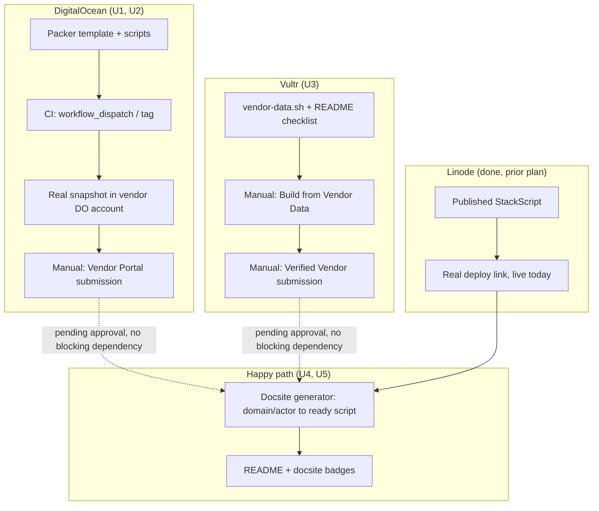

# Marketplace Validation & Deploy Happy Path - Plan

**Product Contract preservation:** unchanged.

## Goal Capsule

**Objective:** Turn the shipped 1-click deploy feature ([[2026-08-29-001-feat-1click-deploy-plan]]) into formally vendor-validated listings on DigitalOcean and Vultr, surface all three provider paths (DO, Vultr, Linode) as discoverable badges on the README and docsite, and remove the "edit domain/actor in raw script text" friction from the DO/Vultr happy path.

**Product authority:** [[nitpub-product-scope]] (v1 scope, now shipped), `docs/plans/2026-08-29-001-feat-1click-deploy-plan.md` (prior deploy work — startup scripts, Linode StackScript, this session's provider research). This plan extends deploy UX; it does not change persona or product shape.

**Open blockers:** none.

## Product Contract

### Key Decisions

1. **Bundle all four outcomes in one plan** *(session-settled 2026-08-31)* — DO Marketplace, Vultr Marketplace, badges, and the script-generator happy-path fix ship together rather than as separate plans, per explicit user choice over splitting them.
2. **Open-ended timeline tolerance on marketplace review** *(session-settled 2026-08-31)* — DO and Vultr publish no review-SLA. No fallback checkpoint; submissions run in the background and badges/docs land whenever approval lands, no EOM-style deadline pressure this round.
3. **DO image maintenance: CI-automated** *(session-settled 2026-08-31)* — a GitHub Actions workflow builds and publishes a fresh Packer image, triggered by both `workflow_dispatch` and release tags, rather than manual rebuilds run by hand. Manual dispatch is the documented primary trigger until DO's re-review cadence is confirmed (KTD3) — "automated" means the build mechanism, not an unattended per-tag cadence from day one.
4. **Happy-path fix: docsite script generator, not marketplace-dependent** — the concrete friction named was editing `NITPUB_DOMAIN`/`NITPUB_ACTOR` in raw script text before pasting. A client-side (no backend) form on the docsite — domain + actor in, ready-to-paste script out — removes that editing step for DO/Vultr today, independent of marketplace approval status. Linode already solves this natively via StackScript UDF fields.
5. **Badges link to our own pages, not native provider buttons** *(carried from this session's research, un-challenged)* — confirmed via official docs that neither DO nor Vultr offer an embeddable droplet-level deploy badge, even after marketplace approval (DO's badge is App Platform-only; no equivalent found for Vultr). DO/Vultr badges link to the docsite one-click-deploy guide (the script generator's location). The Linode badge is a carve-out: if Akamai/Linode publishes an official StackScript badge asset (unverified — see U5), it links directly to the published StackScript rather than through the docsite; otherwise it follows the same docsite-link pattern as DO/Vultr.

### Requirements

- **DigitalOcean Marketplace submission**: a Packer template building a droplet image with nitpub pre-installed/configured for first-boot setup, cleaned and validated per DO's droplet-1-click-apps requirements, submitted through DO's Vendor Portal (onboarding via `one-clicks-team@digitalocean.com`) for review.
- **DO image CI pipeline**: GitHub Actions workflow triggered on nitpub release tags, runs the Packer build, publishes the resulting image per DO's update process.
- **Vultr Marketplace submission**: apply for Verified Vendor status, sign the Publisher Agreement, build an application profile using Vultr's existing imageless "Vendor Data" mechanism (same startup-script approach as the current `deploy/startup-do-vultr.sh`), submit for review.
- **Docsite script generator**: a static, client-side page (no backend/API) where a user enters domain + actor and gets a ready-to-copy DO/Vultr startup script with those values substituted in, replacing the current "edit the top of the pasted script" instruction.
- **Badges**: README and docsite each get badges/links for all three providers (DO, Vultr, Linode), each pointing at the appropriate destination (script generator for DO/Vultr, Linode StackScript deploy link for Linode) rather than a native provider button.

### Non-goals / Exclusions

- No native embeddable "Deploy to DO" / "Deploy to Vultr" button — confirmed not to exist for droplet-level apps by either provider.
- No fallback/deadline if marketplace review stalls — open-ended per Key Decision 2.
- No backend/server component for the script generator — must stay static/client-side.
- Marketplace submission for Linode — already solved via the published StackScript; no vendor-review path pursued there.

### Assumptions

- Whether DO requires re-review on every image update (which would create a review bottleneck on the CI-per-release-tag cadence in Key Decision 3) is **unverified this session** — planning must confirm DO's actual post-approval update-submission process before committing to that cadence. If updates require full re-review each time, the CI trigger frequency (every release vs. periodic/manual) needs revisiting.
- DO's Vendor Portal onboarding process (starting via email to `one-clicks-team@digitalocean.com`) and Vultr's Verified Vendor application are both assumed still current as of this session's research; planning should reconfirm at submission time given no official timeline was published for either.

### Success Criteria

- DO and Vultr Vendor Portal / Verified Vendor applications are submitted (not necessarily approved — approval timeline is open-ended per Key Decision 2).
- The docsite script generator is live and referenced from the one-click-deploy guide as the primary DO/Vultr path, replacing manual script editing.
- README and docsite carry discoverable badges/links for all three providers.
- DO's Packer image builds successfully in CI at least once (manual `workflow_dispatch` run satisfies this — per Key Decision 3 and KTD3, manual dispatch is the primary trigger during the initial cadence-confirmation phase, not tag-push).

## Outstanding Questions

- Whether the docsite script generator should also offer a Linode variant — resolved below (no; StackScript UDF already solves it, generator covers DO/Vultr only, Linode keeps its own deploy link).

---

## Planning Contract

### Key Technical Decisions

**KTD1 — DO: Packer + Vendor Portal, no shortcut exists.** *(Governs Key Decision 3, "DO image maintenance: CI-automated")* Confirmed via `digitalocean/marketplace-partners` (the canonical vendor template repo): a legacy JSON Packer template (`marketplace-image.json`, not `.pkr.hcl`) with the `digitalocean` builder type, sourced from a stock public image slug (e.g. `debian-12-x64`) — not a custom snapshot base. Provisioning runs numbered scripts (`scripts/01-<app>.sh` … our install logic, then two DO-provided, unmodified, mandatory scripts: `90-cleanup.sh` and `99-img-check.sh`). Repo root needs `README.md`, `CHANGELOG.md`, `LICENSE.md`. The build produces a real DO snapshot in the *vendor's own* DO account (storage cost implication), which is then referenced by ID in the Vendor Portal submission — DO does not consume a GitHub repo link directly.

**KTD2 — Vultr: imageless "Build from Vendor Data" is the officially recommended path, not just our default assumption.** Confirmed via `docs.vultr.com/vultr-marketplace`: *"For repeatability and ease of maintenance, we recommend building imageless apps from Vendor Data whenever possible."* No Packer, no snapshot pipeline — Cloud Manager's Builds tab takes a pasted startup script (our existing `deploy/startup-do-vultr.sh` content) directly, produces an "App Image," which is then submitted for Verified Vendor review through the same UI. This matches the Requirements section's Vultr Marketplace submission entry (the imageless/startup-script assumption); no correction needed here, unlike DO.

**KTD3 — DO image CI trigger stays manual-dispatch-first, not automatic per-release-tag.** *(Corrects the "Assumptions" open question from the requirements doc — that question is now resolved, not deferred)* Whether DO requires re-review on every image update was not resolved by this session's research (unverifiable from public docs — it's an internal vendor-portal policy question). Given that uncertainty, U2's CI workflow triggers on `workflow_dispatch` (manual) in addition to release tags, so a real submission-time image update can be produced on demand without assuming an automatic per-tag cadence is safe. Once the actual DO update process is confirmed at first real submission, the trigger can be tightened to fully automatic if appropriate — that's an execution-time follow-up, not a planning-time guess.

**KTD4 — Docsite generator is DO/Vultr-only, VitePress `<script setup>`, no backend.** *(Resolves the requirements doc's Outstanding Question)* Linode's UDF mechanism already gives real form fields at deploy time — a generator for Linode would be redundant and would create two competing "correct" paths for the same provider. The generator lives inside the existing `docsite/docs/guide/one-click-deploy.md` page (not a separate page) as an embedded Vue-in-markdown widget, following the exact pattern already used in `docsite/docs/changelog.md` (`<script setup>` + a Vue-templated block + scoped `<style>`, no new build tooling).

### Risks & Dependencies

- **DO Packer build needs a real `DIGITALOCEAN_TOKEN` secret with account-level access, currently ungated.** As scoped, any collaborator who can dispatch the workflow or push a `v*` tag triggers a job that runs repo-controlled scripts with that token in scope — effectively code execution against the DO account, not just image-build access. U2 must put the token-consuming job behind a GitHub Environment with required-reviewer protection, and the token itself should be generated with DO's scoped-permissions feature (image/droplet read-write) rather than a default full-account token, to bound the blast radius of a leak or a malicious PR. Every CI-triggered build also creates a real (billed) snapshot in the vendor DO account — stale/superseded snapshots need manual cleanup periodically; not automated in this plan (see Deferred to Follow-Up Work), so the Operational Notes below name a concrete review cadence rather than leaving it open-ended.
- **Neither DO nor Vultr consume our GitHub repo directly** — both require content pasted/uploaded through their own vendor portals by a human with account access. U1/U2/U4's code prepares the artifacts; the actual portal submission (account creation, form-filling, snapshot ID entry) is a manual step outside `ce-work`'s reach — captured in Operational/Rollout Notes below, not as code-bearing units.
- **DO update/re-review cadence unknown** — see KTD3. Mitigated by defaulting the CI trigger to manual-dispatch rather than assuming automatic-per-tag is safe.

### Sources & Research

- `digitalocean/marketplace-partners` (GitHub) — canonical Packer template repo: `marketplace-image.json`, `scripts/` numbering convention, `90-cleanup.sh`/`99-img-check.sh` as DO-provided mandatory scripts, root `README.md`/`CHANGELOG.md`/`LICENSE.md`.
- [docs.digitalocean.com/products/marketplace/droplet-1-click-apps](https://docs.digitalocean.com/products/marketplace/droplet-1-click-apps/) — droplet-level Marketplace app requirements.
- [docs.vultr.com/vultr-marketplace](https://docs.vultr.com/vultr-marketplace) — imageless "Build from Vendor Data" recommended path, direct quote cited in KTD2.
- [docs.vultr.com/platform/marketplace/build-an-example-app](https://docs.vultr.com/platform/marketplace/build-an-example-app) — Packer/snapshot path (alternative, not used here).
- `docsite/docs/changelog.md:1-56` — existing VitePress `<script setup>` pattern this plan's generator follows.
- `.github/workflows/release.yml` — existing release-tag-triggered CI pattern (cross-compile + GitHub Release) that U2's workflow structurally mirrors, adding the Packer build step.
- `deploy/startup-do-vultr.sh` — existing DO/Vultr startup script; U1 and U4 both build on its install invocation rather than duplicating it.

---

## High-Level Technical Design

Three provider pipelines, structurally different, converging only at the docsite/README badge layer:

The dotted lines are the key structural point: badge/generator work (U4, U5) does not wait on marketplace approval — it ships against whatever exists today (a script to paste, a published StackScript), and badges get upgraded in place if/when DO or Vultr approval lands, per Key Decision 2's open-ended timeline.

---

## Implementation Units

### U1. DigitalOcean Packer template + provisioning scripts

**Goal:** A Packer template that builds a DO Marketplace-ready snapshot with nitpub installed, following DO's mandatory vendor structure.

**Requirements:** Advances Requirements (DO Marketplace submission), KTD1.

**Dependencies:** none.

**Files:**
- `deploy/marketplace/digitalocean/marketplace-image.json` (new)
- `deploy/marketplace/digitalocean/scripts/01-nitpub-install.sh` (new)
- `deploy/marketplace/digitalocean/scripts/90-cleanup.sh` (new — DO-provided content, copied verbatim from `digitalocean/marketplace-partners`, not authored)
- `deploy/marketplace/digitalocean/scripts/99-img-check.sh` (new — same, DO-provided verbatim)
- `deploy/marketplace/digitalocean/README.md` (new)
- `deploy/marketplace/digitalocean/CHANGELOG.md` (new)
- `deploy/marketplace/digitalocean/LICENSE.md` (new — copy of repo root `LICENSE`)

**Approach:**
1. Before finalizing the image slug: confirm the OS/version `deploy/startup-do-vultr.sh` targets appears on DO's Marketplace-eligible base image list (the existing script's OS was chosen for general droplet deploys, not vetted against Marketplace's accepted set — an ineligible slug fails at the first real Packer build, not at review).
2. Packer template (`marketplace-image.json`): `digitalocean` builder type, `image` set to the confirmed-eligible public slug, provisioners list pointing at the numbered scripts in order.
3. `01-nitpub-install.sh`: install nitpub the same way `deploy/startup-do-vultr.sh` does (download release binary via `scripts/install.sh`, run `nitpub install`) — but **without** the domain/actor/password prompts, since a Marketplace image boots generically and the *first-boot* config (domain, actor, admin password) has to happen after the customer deploys from the image, not baked in at build time.
4. Decide the first-boot config mechanism (first-login CLI prompt, MOTD instructions, or still-accepted user-data — confirm DO's convention against `marketplace-partners`'s example apps; genuinely an execution-time decision, not resolved here) and **write the chosen mechanism into `deploy/marketplace/digitalocean/README.md`** as part of this unit's deliverables — U1's own Verification step below depends on that mechanism being documented somewhere concrete, not invented ad hoc at test time.
5. `90-cleanup.sh` / `99-img-check.sh`: fetch verbatim from `digitalocean/marketplace-partners`'s template — do not author custom versions, DO's review process expects these unmodified.
6. `CHANGELOG.md`/`LICENSE.md`: standard vendor-facing docs DO's portal review reads.

**Patterns to follow:** `deploy/startup-do-vultr.sh`'s install invocation (`scripts/install.sh` → `nitpub install`); `digitalocean/marketplace-partners`'s template shape (cited in Sources).

**Test scenarios:**
- Happy path: `packer build marketplace-image.json` completes locally against a real (test) DO account, produces a snapshot.
- Test expectation for `90-cleanup.sh`/`99-img-check.sh`: none — copied verbatim from DO's own template, not authored logic to test.
- Integration: boot a droplet from the resulting snapshot, confirm nitpub's systemd unit is present and the documented first-boot config path works end to end (domain/actor set, `/healthz` reachable after config).

**Verification:** A real Packer build against a test DO account produces a working snapshot; a droplet created from that snapshot reaches the same verified end-state (`/healthz`, webfinger) as the existing startup-script path, after completing whatever first-boot config step U1 settles on.

---

### U2. DigitalOcean image CI pipeline

**Goal:** Automate building (not necessarily auto-submitting) the DO Marketplace image so it stays current with nitpub releases.

**Requirements:** Advances Requirements (DO image CI pipeline), Key Decision 3, KTD3.

**Dependencies:** U1.

**Files:**
- `.github/workflows/marketplace-digitalocean.yml` (new)

**Approach:**
1. Trigger: `workflow_dispatch` (manual, primary per KTD3) plus `push: tags: v*` (mirrors `.github/workflows/release.yml`'s trigger, but the manual dispatch stays the documented primary path until DO's re-review cadence is confirmed).
2. Job runs behind a GitHub Environment (e.g. `do-marketplace`) with required-reviewer protection, so `DIGITALOCEAN_TOKEN` is only exposed after manual approval — regardless of whether the run was triggered by dispatch or a pushed tag. Without this, any collaborator who can dispatch the workflow or push a `v*` tag gets that token in scope for a job running repo-controlled scripts (Risks & Dependencies).
3. Generate `DIGITALOCEAN_TOKEN` using DO's scoped-token feature, restricted to image/droplet read-write — not a default full-account personal access token.
4. Job: checkout, install Packer, `packer build deploy/marketplace/digitalocean/marketplace-image.json`, authenticated via the scoped `DIGITALOCEAN_TOKEN` repository secret (new secret, not yet configured — implementer must add it before this workflow can run for real).
5. On success, surface the resulting snapshot ID/name in the workflow run output (job summary) for manual entry into the DO Vendor Portal — this workflow builds the artifact, it does not submit it (see Risks & Dependencies: DO doesn't consume repo links).

**Patterns to follow:** `.github/workflows/release.yml`'s structure (checkout → setup → build → publish-output).

**Test scenarios:**
- Happy path: manual `workflow_dispatch` run completes, produces a snapshot ID in the job summary.
- Error path: build fails if `DIGITALOCEAN_TOKEN` is missing/invalid — should fail loudly in the Packer step, not silently skip.
- Test expectation: none beyond the above — this is a CI workflow, not application code; verification is a real run, not unit tests.

**Verification:** A real `workflow_dispatch` run against the configured DO account produces a valid snapshot; a second run (idempotency check) does not corrupt or fail unexpectedly.

---

### U3. Vultr Marketplace submission artifacts

**Goal:** Prepare the artifacts Vultr's "Build from Vendor Data" flow needs, reusing the existing startup script.

**Requirements:** Advances Requirements (Vultr Marketplace submission), KTD2.

**Dependencies:** none.

**Files:**
- `deploy/marketplace/vultr/vendor-data.sh` (new — copy of `deploy/startup-do-vultr.sh`'s content, or a symlink/reference if the repo convention prefers not to duplicate; implementer's call per KTD1's "no shortcut" spirit doesn't apply here since Vultr's path genuinely takes the same script)
- `deploy/marketplace/vultr/README.md` (new — application-profile reference: app name, description, category, logo requirements per Vultr's Build-from-Vendor-Data UI fields)

**Approach:**
1. Confirm whether Vultr's Vendor Data field accepts `deploy/startup-do-vultr.sh` verbatim or needs Vultr-specific tweaks (the script is already provider-agnostic bash with no DO-specific assumptions, so verbatim reuse is the expected outcome — verify at submission time, not planning time).
2. `README.md` documents what the Cloud Manager Build-from-Vendor-Data UI will ask for (name, description, category, logo image), so the actual portal submission (a manual step, see Operational Notes) has a checklist instead of starting from zero.

**Patterns to follow:** `deploy/startup-do-vultr.sh` (reused directly).

**Test scenarios:**
- Test expectation: none — this unit is documentation/artifact-preparation, not new executable logic. The underlying script already has its own test scenarios from the prior deploy plan.

**Verification:** `deploy/marketplace/vultr/vendor-data.sh` content matches `deploy/startup-do-vultr.sh` exactly (or documents why it diverges); README checklist is complete enough that the manual portal submission (Operational Notes) doesn't need to research field requirements again.

---

### U4. Docsite deploy-script generator

**Goal:** Remove the "edit `NITPUB_DOMAIN`/`NITPUB_ACTOR` in raw script text" step for DO/Vultr — a client-side form that outputs a ready-to-paste script.

**Requirements:** Advances Requirements (docsite script generator), KTD4.

**Dependencies:** none (independent of U1-U3; ships regardless of marketplace approval status).

**Files:**
- `docsite/docs/guide/one-click-deploy.md` (modify — replace the "editing `NITPUB_DOMAIN` and `NITPUB_ACTOR` at the top first" instructions in the DigitalOcean and Vultr sections with the generator widget)

**Approach:**
1. Add **one** `<script setup>` block, following `docsite/docs/changelog.md`'s pattern, shared by both the DigitalOcean and Vultr subsections — a single reactive (domain, actor) state, since DO and Vultr paste the identical script (KTD2). Do not duplicate the widget per-provider: two independent instances would make a reader re-enter the same domain/actor twice with no explanation why. Label the widget generically (e.g. "Generate your deploy script") rather than under either provider's heading alone, and reference it by anchor from both subsections' step 2, so scrolling directly to `#vultr` still shows a clearly-shared tool rather than one that visually reads as DO-only.
2. Computed property interpolates the two inputs into the existing `deploy/startup-do-vultr.sh` template text (embedded as a JS template string in the component, kept in sync with the real file — see Deferred Implementation Notes on drift risk).
3. Domain field validation: empty domain disables the copy button (does not merely flag the output visibly) — the incomplete-domain edge case has one behavior, not an implementer's choice between two. Additionally, strip or reject characters that would break out of the generated script's shell-quoted context (quotes, backslashes, embedded newlines) before interpolation, since the output is unattended root-executed bash a reader pastes without reviewing character-by-character.
4. Copy-to-clipboard button shows a brief post-click confirmation state (e.g. label toggles to "Copied!" for ~2 seconds) on success, and a visible inline error if the Clipboard API call rejects (permissions, insecure context) rather than failing silently.
5. Replace steps 2 in both the DigitalOcean and Vultr subsections of `one-click-deploy.md`: instead of "paste `deploy/startup-do-vultr.sh`, editing the top two values," the instruction becomes "fill in your domain/actor below, copy the generated script, paste it."
6. Linode's subsection is untouched — KTD4 keeps the generator DO/Vultr-only.

**Deferred implementation notes:** The generator embeds a copy of the script text to interpolate into; keeping that copy in sync with `deploy/startup-do-vultr.sh` if the real script changes is a manual-sync risk this plan doesn't automate (a build-time script that generates the embedded template from the real file would remove the drift risk, but is more machinery than this plan's scope — flag as a candidate for Deferred to Follow-Up Work if drift becomes a real problem).

**Patterns to follow:** `docsite/docs/changelog.md:5-17` (`<script setup>` shape), `:31-55` (scoped `<style>` shape).

**Test scenarios:**
- Happy path: enter a domain and actor, generated script text contains both values correctly substituted, no other content altered.
- Happy path: shared widget state — filling in domain/actor in the DigitalOcean subsection updates the same generated output visible from the Vultr subsection (single shared instance, not two independent ones).
- Edge case: empty domain — copy button is disabled, no script text generated (not a visible-flag-only fallback).
- Edge case: domain containing quotes/backslashes/newlines — rejected or stripped before interpolation, not passed through into the copyable script.
- Edge case: actor left blank — defaults to `"user"`, matching the underlying script's own convention.
- Happy path: successful copy shows a confirmation state; a rejected clipboard write shows a visible error instead of failing silently.
- Test expectation: `docsite` build passes (VitePress build catches Vue syntax errors); manual browser check for the interactive behavior, since this repo has no existing frontend test harness for docsite components (matches the "Documentation content, no executable behavior" precedent from the original deploy plan's docsite unit — except this one *does* have client-side logic, so a manual verification pass replaces automated coverage rather than being skipped).

**Verification:** `docsite` builds cleanly; manually filling the form in a browser produces a correct, ready-to-paste script matching what `deploy/startup-do-vultr.sh` would look like with those values hand-edited in.

---

### U5. README and docsite badges

**Goal:** Make all three deploy paths discoverable from the README, not just buried in docsite subpages.

**Requirements:** Advances Requirements (badges), Key Decision 5 (badges link to our own pages, not native provider buttons).

**Dependencies:** U4 (badges should point at the generator once it exists, not the old manual-edit instructions).

**Files:**
- `README.md` (modify — add a "Deploy" section near the top with three links/badges)
- `docsite/docs/guide/one-click-deploy.md` (modify — add a summary badge row at the top, above the per-provider sections)

**Approach:**
1. DO and Vultr badges: shield-style badge images (e.g. via shields.io static badge generation, no new dependency — just an image URL) linking to `docsite/docs/guide/one-click-deploy.md#digitalocean` / `#vultr` anchors (the generator's location), since neither provider offers an embeddable native deploy button (Key Decision 5).
2. Linode badge: **check at implementation time** whether Akamai/Linode publishes an official "Deploy to Linode" StackScript badge image/markdown snippet (unverified this session — this session's research covered DO/Vultr badge availability, not Linode's specifically). If one exists, use it linking directly to the published StackScript (`cloud.linode.com/stackscripts/2203935`) per Key Decision 5's carve-out; if not, use the same shields.io-style badge as DO/Vultr, linking to the docsite's Linode subsection — prefer visual consistency across the three-badge row when both options are otherwise equal, since an official Linode badge would look different from the other two.
3. Replace the Linode subsection's current placeholder text ("*(TODO: publish `deploy/startup-linode.stackscript.sh` as a public StackScript and link it here)*") with the real link — the StackScript has been live since the prior session (ID 2203935); this text was never updated to match.
4. Badge row placement in `one-click-deploy.md` gives a reader an immediate 3-way choice before reading provider-specific prose, mirroring common README "quick links" patterns.

**Patterns to follow:** none in-repo (first badge usage) — shields.io static badges are a common zero-dependency convention (an `` with a `shields.io` URL, no API key, no build step).

**Test scenarios:**
- Test expectation: none — pure documentation/markdown content, no executable behavior.

**Verification:** All three badge links resolve to the correct destination; `docsite` build passes; README renders correctly on GitHub's markdown preview.

---

## Verification Contract

- U1/U2: a real Packer build (local or via `workflow_dispatch`) against a test DO account produces a working snapshot; a droplet from that snapshot reaches the same verified end-state as the existing startup-script path.
- U3: Vultr's Build-from-Vendor-Data flow accepts the vendor-data script verbatim (confirmed at actual submission time, not automatable from this repo).
- U4: `docsite` build passes; generator produces correct output for at least one real domain/actor pair, verified manually in a browser.
- U5: all badge links resolve; `docsite` build passes.

## Definition of Done

- `deploy/marketplace/digitalocean/` exists with a working Packer template, verified via a real build producing a snapshot.
- `.github/workflows/marketplace-digitalocean.yml` exists and has completed at least one successful manual run (requires `DIGITALOCEAN_TOKEN` secret to be configured — a manual prerequisite, not code).
- `deploy/marketplace/vultr/` exists with the vendor-data script and submission-profile README.
- Docsite generator live in `one-click-deploy.md`, DO/Vultr sections updated to reference it instead of manual editing.
- README and docsite carry badges for all three providers.
- **Explicitly not required for "done":** DO Vendor Portal / Vultr Verified Vendor approval itself — per Key Decision 2 (open-ended timeline), this plan's Definition of Done is "submission-ready artifacts exist and the manual submission has been made," not "approved and live."

## Operational / Rollout Notes

These are manual, portal-based steps outside `ce-work`'s reach — no code executes them, a human with account access does:

1. **DO Vendor Portal onboarding** — email `one-clicks-team@digitalocean.com` to request access, then submit U1's built snapshot (via U2's CI output) through `cloud.digitalocean.com/vendorportal`.
2. **Vultr Verified Vendor application** — apply through Vultr's Cloud Manager, sign the Publisher Agreement, use U3's `vendor-data.sh` + README checklist to fill out the Build-from-Vendor-Data flow.
3. Both are **independent and can proceed in parallel** — no ordering dependency between them.
4. Neither has a published review-timeline SLA (Key Decision 2) — no follow-up checkpoint scheduled; badges/docs already work regardless of approval status since U4/U5 don't depend on approval, only on the artifacts existing.
5. **Snapshot cost review** — review and prune stale DO snapshots from CI runs at least quarterly, or after every ~5 `workflow_dispatch` runs, whichever comes first. No automated cleanup exists (Deferred to Follow-Up Work); this is the interim manual checkpoint.
6. **Vendor account ownership** — name which DO account and which Vultr account hold Vendor Portal / Verified Vendor access before submitting either application, require MFA on both, and note the handoff plan if that account's owner changes. Both are long-term credentials of record for the resulting marketplace listings, not one-time submission logins.

## Scope Boundaries

### Deferred to Follow-Up Work

- Automated cleanup of stale DO snapshots produced by repeated CI runs (Risks & Dependencies).
- A build-time sync mechanism between U4's embedded script template and the real `deploy/startup-do-vultr.sh`, if manual drift becomes a real problem.
- Tightening U2's CI trigger from manual-dispatch-primary to fully-automatic-per-release-tag, once DO's actual re-review cadence is confirmed at first real submission (KTD3).
